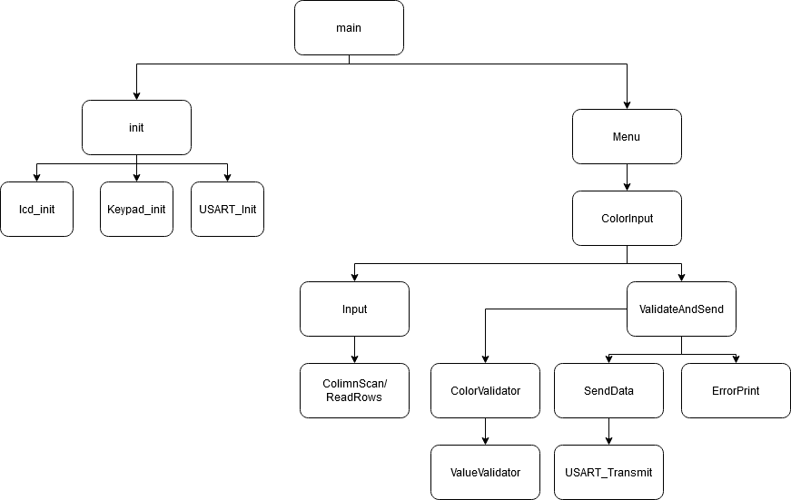
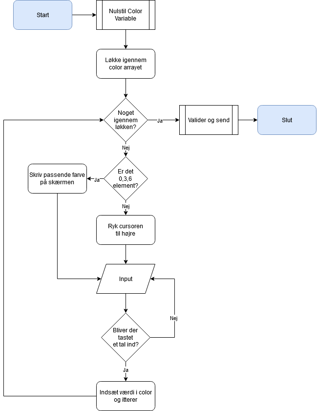
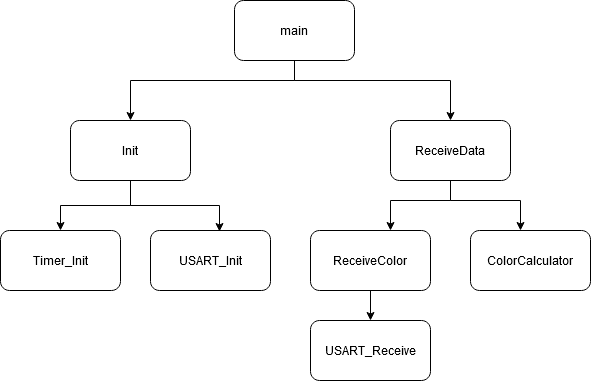
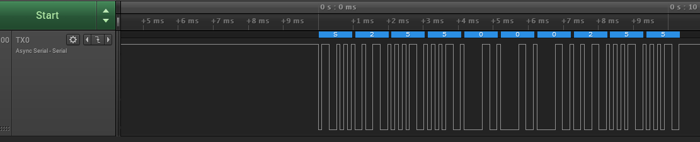

# ProjectJoachimHUE
 Projekt til Embedded 2

## Projektets opbygning
Det går ud på at i det smarte hus kan man styrer lysets farve med en keypad, keypadden skal pladseres på MEGA2560 sammen med en display, når man er færdig med at indtaste lysinformation (RGB) bliver den sent over seriel til et uno board.

Elementer der skal implamenteres:
- LCD til information der bliver indtastet
- Keypad der skal være bruger indtast
- RGB LED der skal outputte lyset med informationen

Ekstra:
- Kører informationen over seriel til et UNO board der så for led'en til at lyse
- ~~Et menu system til LCD panelet~~

## Opsætning af Projekt
---
Der skal bruges:
- Arduino UNO
- MEGA2560
- 1602a lcd arduino
- 10k potentiometer
- Membraneswitch module (Keypad)
- 3x 330Ω modstande
- RGB LED
- Breadboard med nok ledninger
- Kabler og udstyr til at skrive og strømfører til Arduino UNO og MEGA2560

det software der er inkluderet i dette projekt installeres på MEGA2560. Yderlig skal der bruges [ProjektJoachimHueSlave](https://github.com/JoachimToefting/ProjectJoachimHueSlave) som skal kørers på Arduino UNO. Projektet inkludere en README.md der forklare kun dens opsætning de andre enmer er i denne README.

## Opsætning af Hardware
---
### LCD
Nogle tegninger
| LCD | Board | PORT  |
| :-: | :---: | :---: |
| VSS |  GND  |
| VDD |  5V   |
| V0  | Pot*  |
| RS  |   6   |  PH3  |
| RW  |   7   |  PH4  |
| E   |   8   |  PH5  |
| D4  |  22   |  PA0  |
| D5  |  23   |  PA1  |
| D6  |  24   |  PA2  |
| D7  |  25   |  PA3  |
| A   |  5v   |
| K   |  5v   |

*til det tredjeben på potentiometeret

```RS``` til ```D7``` kan indstilles til ønskede porte og pin i filen lcd.h

### Keypad
En tegning
| Keypad | Board | PORT  |
| :----: | :---: | :---: |
| 1      |  A8   |  PK0  |
| 2      |  A9   |  PK1  |
| 3      |  A10  |  PK2  |
| 4      |  A11  |  PK3  |
| 5      |  A12  |  PK4  |
| 6      |  A13  |  PK5  |
| 7      |  A14  |  PK6  |
| 8      |  A15  |  PK7  |

## Kodens Opbygning
### Master
---
ProjectJoachimHue er beregnet til at kører på MEGA2560.



Programmet er opsat med en Init funktion der skal sørge for at lcd, keypad og USART er opsat korrekt med den rigtige konfiguration.

ColorInput er hovede elementet i dette program men der kan udvides med en menu hvor en af mulighederne er ColorInput. Her ses et Flowchart af ColorInput:


### Slave
---
ProjectJoachimHueSlave er beregnet til at kører på Arduino UNO.



Programmet er opsat med en Init funktion  der skal sørge for at RGB LED og USART er sat rigtig op.

Hvis man gerne vil udvide hvad dette board kan kan det tilføjes til ReceiveData switchcase der switcher på hvad der bliver modtaget, se mere i serial forbindelse for mere information om forbindelsen mellem de to board.

### Seriel forbindelse
Forbindelsen er designet med et forbogstav og derefter en bestemt mængde bytes f.eks ```S``` som bliver brugt til at signalere et lysskifte og derefter 9 bytes. Hvis man ønsker at udvide projektet kan man tilføje sin egen funktioner og resevere en char mere.

## Sådan bruges interfacet:
---
Der vil på displayet blive vist:
```
Color:
Red:
```
Her vælges hvor stærk den røde farve skal blive fra 000 til 255 der skal indtastet tre cifre, dette gøres også for blå: ```Blue``` og grøn: ```green```.
Der skal skrives **3 cifre**.

## Forstå Errors
---

Efter indtastning af farver kan der ses:
```
No color set,
Error: X
```
Hvis X er ```-1``` er det fordi en af indtastningerne ikke er et tal.

Hvis X er ```-2``` er det fordi en af indtastningerne ikke er inden for 0 til 255.

---

LCD Cursor'en blinker ikke det rigtige sted:

	Reset MEGA2560

---

Hvis der ikke bliver skiftet farve på led når alle farve værdier er indtastet korrekt kan der laves følgende test:
### Test af Opsætning
For at se om man har installeret projektet rigtigt kan der gørers følgende:

Test af seriel tranmission med USB:

- Der skal bruges et USB kabel til MEGA2560
- Kablet sættes til PC'en og til MEGA2560
- Åben en terminal på PC'en
- Og tilslut med Default settings til COM porten der bruges
- Indtast de tre farvekoder

Test af seriel transmission med Logic analyzer:

- Tilføj logic analyzeres jord til breadboardets jord.
- Tilføj logic analyzeres data0 til en ledning der går fra TX0 på MEGA2560
- Tilføj USB mellem logic analyzeren og PC'en
- Start Logic på PC'en
- Sample rate 25 MS/s og Duration 20 milliseconds
- Vælg kun at vise channel 0
- Skift trigger til Falling egde
- Start måling og indtast de 3 farver på keypaden
- Tilføj Protocol Analyzer
- Async Serial
- Skift ikke settings og save
  
Hvis konfigureret korrekt burde der ses f.eks:



Hvis det er konfigureret korrekt vil der blive vist f.eks ```S255000255``` i terminalen, hvis der er blevet indtastet Rød:255 Grøn:000 Blå:255.

Hvis det ikke blev vist skal der tjekkes følgende:

- TXEN0 bittet i Registreret: UCSR0B er sat til 1 da det er den der er tilsluttet USB seriel interfacet, en logic analyzeren kan bruges hvis man ikke bruger TX0.
- USART.h er opsat med de korrekte ```#define``` som i orginalt projektet